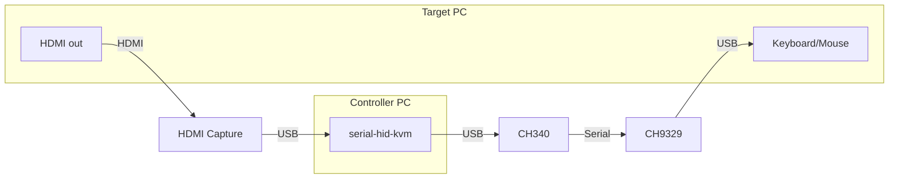

# serial-hid-kvm

Standalone KVM (Keyboard, Video, Mouse) controller using a CH9329 USB HID emulator over serial and a USB HDMI capture device. Provides an interactive preview window with full keyboard/mouse pass-through, a web-based remote viewer, and a JSON Lines API for programmatic automation.

## What It Does

Turn two cheap USB devices (~$15 total) into a software KVM switch. Control any PC's keyboard and mouse over USB while watching its screen via HDMI capture — all from another PC, a script, or an AI agent.



## Features

- **Interactive preview window** — see the target screen in real-time, type and click as if you were sitting in front of it
- **Full keyboard capture** (Windows) — Win32 low-level hook captures all keys including Win, Alt+Tab when the preview window is focused (Ctrl+Alt+Del via Ctrl+Alt+End)
- **Web-based remote viewer** — browser-based remote desktop with keyboard/mouse over WebSocket (`--web`); optional password login (`--web-password`) and native TLS (`--web-tls-cert`) for remote / public internet deployment
- **API server** (`--api`) — JSON Lines protocol over TCP socket for programmatic automation from any language; also available as an MCP server via [mcp-serial-hid-kvm](https://github.com/sunasaji/mcp-serial-hid-kvm) or as a CLI via [cli-serial-hid-kvm](https://github.com/sunasaji/cli-serial-hid-kvm)
- **Python client library** — thread-safe client with auto-reconnect for scripting and AI agent integration
- **Multiple concurrent clients** — one KVM server, many API clients (AI agents, scripts, etc.)
- **Headless mode** — run without preview window; combine with `--api` and/or `--web`
- **Multi-layout support** — US, JP (JIS), UK, DE, FR keyboards for API text input (some special characters like umlauts, accented characters, and £ are not yet supported in non-US/JP layouts)
- **Audio streaming** — HDMI audio playback in preview window and web viewer; auto-detected from capture device VID:PID, or specify manually with `--audio-device`
- **Auto-crop black borders** — automatically detects and crops pillarboxing/letterboxing from HDMI capture when the target resolution doesn't match the capture output (e.g. 1024x768 on a 1080p dongle); mouse coordinates adjust automatically
- **Auto-detection** — finds CH340 serial adapter, HDMI capture device, and matching audio input automatically

## Use Cases

- **AI-driven PC automation** — let Claude or other AI agents control a PC via [mcp-serial-hid-kvm](https://github.com/sunasaji/mcp-serial-hid-kvm) or [cli-serial-hid-kvm](https://github.com/sunasaji/cli-serial-hid-kvm)
- **Remote KVM over network** — lightweight IP-KVM with commodity hardware
- **Automated testing** — drive real hardware UI tests via the API
- **Headless server management** — access BIOS/UEFI setup, OS installers, or machines without network
- **Security testing** — HID-level input that is indistinguishable from a real keyboard

## Hardware Requirements

| Device | Purpose | Typical Cost |
|--------|---------|-------------|
| CH9329 + CH340 cable | USB HID emulator via serial | ~$5 |
| USB HDMI capture dongle | Screen capture | ~$10 |

The CH9329 appears as a standard USB keyboard/mouse to the target PC — no drivers needed on the target side.

## Installation

Requires Python 3.10+.

```bash
# Ubuntu/Debian: venv package may need to be installed first
sudo apt install python3-venv

python3 -m venv .venv
source .venv/bin/activate
pip install -e .
```

On Linux, add your user to the required groups and install dependencies:

```bash
sudo usermod -a -G dialout $USER  # Serial port access
sudo usermod -a -G video $USER    # Video capture access
# Log out and back in for group changes to take effect

sudo apt install xdotool  # Required for preview window focus detection
```

## Quick Start

```bash
# Preview window only (default)
serial-hid-kvm

# Preview + API server
serial-hid-kvm --api

# Headless with API server
serial-hid-kvm --headless --api

# Headless with web viewer
serial-hid-kvm --headless --web

# Headless with both API + web
serial-hid-kvm --headless --api --web

# Web viewer accessible from LAN  ⚠️ USE WITH CAUTION — see Remote Access and Security
serial-hid-kvm --headless --web --web-host 0.0.0.0

# Web viewer on the network with password login (see Public Internet Deployment)
serial-hid-kvm --headless --web --web-host 0.0.0.0 --web-password mypass

# API server accessible from LAN  ⚠️ USE WITH CAUTION — see Remote Access and Security
serial-hid-kvm --headless --api --api-host 0.0.0.0

# Both API + web accessible from LAN  ⚠️ USE WITH CAUTION — see Remote Access and Security
serial-hid-kvm --headless --api --api-host 0.0.0.0 --web --web-host 0.0.0.0

# Custom settings
serial-hid-kvm --headless --api --api-port 9400 --web --web-port 8080

# Web viewer with audio (auto-detected; override with --audio-device DEV)
serial-hid-kvm --headless --web

# Japanese keyboard layout
serial-hid-kvm --target-layout jp106

# List devices (shows [auto-detect target] markers)
serial-hid-kvm list-devices

# Use config file
serial-hid-kvm --config my.yaml
```

By default, only the preview window runs. API server (`--api`, default port 9329) and web viewer (`--web`, default port 9330) are opt-in. Both bind to `127.0.0.1` by default; use `--api-host` / `--web-host` to change.

## Remote Access and Security

By default the API server and web viewer bind to `127.0.0.1` and are not exposed to the network.

The **web viewer** has built-in authentication and TLS for remote use:

- `--web-password PW` (prefer the `SHKVM_WEB_PASSWORD` env var so the password stays out of the process list) — clients must authenticate over the WebSocket before any video, audio, or input flows (the capture device is not even opened for unauthenticated clients). Failed attempts are throttled (1.5 s delay per attempt, 30 s per-IP lockout after 5 failures). After login the browser holds a session token, so WebSocket reconnects and tab reloads re-authenticate silently; restarting the server invalidates all sessions.
- `--web-tls-cert FILE` / `--web-tls-key FILE` — serve https/wss directly with a PEM certificate/key pair. Alternatively terminate TLS at a reverse proxy or tunnel (see below).

The **API server** (`--api`) has **no authentication** — keep it on `127.0.0.1` and reach it remotely only through:

- **SSH tunnel** — `ssh -L 9329:127.0.0.1:9329 kvm-host`
- **Tailscale / WireGuard** — VPN-level protection without exposing ports

To put the web viewer on the public internet, see [Public Internet Deployment](#public-internet-deployment).

## Public Internet Deployment

Goal: open a URL from anywhere on the internet and control the target PC. The KVM host (the PC with the CH9329 + capture dongle) usually sits behind NAT, so pick one of the paths below. The web viewer is plain HTTP + WebSocket on a single port (9330), so any TCP tunnel or reverse proxy works — video, audio, input, and recording all ride the same connection.

**Always set a password first** — a public KVM without one hands full keyboard/mouse control of the target to the whole internet:

```powershell
# Windows (PowerShell)
$env:SHKVM_WEB_PASSWORD = "use-a-long-random-password"
serial-hid-kvm --headless --web
```

```bash
# Linux
SHKVM_WEB_PASSWORD="use-a-long-random-password" serial-hid-kvm --headless --web
```

### Option A: VPS with a public IP + frp tunnel

If you have a VPS, run [frp](https://github.com/fatedier/frp): `frps` on the VPS, `frpc` on the KVM host. The web viewer keeps its default `127.0.0.1` bind — `frpc` connects to it locally.

`frps.toml` (VPS):

```toml
bindPort = 7000
auth.token = "a-long-shared-secret"
# keep tunnel ports off the public interface if nginx terminates TLS (below)
# proxyBindAddr = "127.0.0.1"
```

`frpc.toml` (KVM host):

```toml
serverAddr = "your-vps-ip"
serverPort = 7000
auth.token = "a-long-shared-secret"

[[proxies]]
name = "kvm-web"
type = "tcp"
localIP = "127.0.0.1"
localPort = 9330
remotePort = 9330
```

Then open `http://your-vps-ip:9330`. For HTTPS, put nginx with a Let's Encrypt certificate in front on the VPS (uncomment `proxyBindAddr` above so only nginx can reach the tunnel port):

```nginx
server {
    listen 443 ssl;
    server_name kvm.example.com;
    ssl_certificate     /etc/letsencrypt/live/kvm.example.com/fullchain.pem;
    ssl_certificate_key /etc/letsencrypt/live/kvm.example.com/privkey.pem;

    location / {
        proxy_pass http://127.0.0.1:9330;
        proxy_http_version 1.1;
        proxy_set_header Upgrade $http_upgrade;
        proxy_set_header Connection "upgrade";
        proxy_read_timeout 1d;    # long-lived WebSocket
    }
}
```

### Option B: No VPS — Cloudflare Tunnel

Free, no public IP and no open inbound ports; HTTPS is automatic. Requires a domain managed by Cloudflare. On the KVM host:

```bash
cloudflared tunnel login
cloudflared tunnel create kvm
cloudflared tunnel route dns kvm kvm.example.com
cloudflared tunnel run --url http://127.0.0.1:9330 kvm
```

Open `https://kvm.example.com` — WebSocket passes through by default. For a second authentication layer (before the request even reaches your machine), add a Cloudflare Access policy to the hostname.

### Option C: Router port forwarding (ISP gives you a public IP)

Forward a router TCP port (e.g. 443) to the KVM host's 9330 and use DDNS if your IP changes. Since there is no proxy to terminate TLS, use the built-in TLS so the password and session never travel in clear text:

```bash
openssl req -x509 -newkey rsa:2048 -nodes -days 3650 \
  -keyout key.pem -out cert.pem -subj "/CN=kvm"

SHKVM_WEB_PASSWORD=... serial-hid-kvm --headless --web \
  --web-host 0.0.0.0 --web-tls-cert cert.pem --web-tls-key key.pem
```

The browser warns about the self-signed certificate — after accepting, traffic is still fully encrypted. Use a real certificate (Let's Encrypt + DDNS domain) to avoid the warning.

### Remote-use notes

- The default JPEG/WebSocket video works over all of the above. The **H264** (WebRTC) mode also works remotely in many networks — when the page is served from a non-private host, the viewer adds a public STUN server for NAT traversal — but strict NATs or UDP-blocking firewalls can defeat it; if H264 fails, stay on the default stream.
- **Direct** mode is local-only by design (the browser opens the capture card itself) — remote viewers can't use it.
- Never forward the API port (9329) — it has no authentication. Use an SSH tunnel or VPN instead.

## Configuration

Settings are resolved with priority: **CLI args > environment variables > config file > defaults**.

### CLI Arguments

```
serial-hid-kvm [OPTIONS] [COMMAND]

Commands:
  list-devices              List devices with auto-detect markers and exit

Options:
  --headless                Run without preview window
  --log-file PATH           Also write logs to a file (in addition to stderr)
  --debug-keys              Print keycode debug output to console
  --show-cursor             Show mouse cursor on preview window
  -c, --config FILE         Path to YAML config file

  --api                     Enable API server (JSON Lines over TCP socket)
  --api-host ADDR           API server bind address (default: 127.0.0.1)
  -p, --api-port PORT       API server port (default: 9329)

  --web                     Enable web-based remote desktop viewer
  --web-host ADDR           Web viewer bind address (default: 127.0.0.1)
  --web-port PORT           Web viewer port (default: 9330)
  --web-fps FPS             Web viewer frame rate (default: 20)
  --web-quality Q           Web viewer JPEG quality 1-100 (default: 60)
  --web-password PW         Require a password for the web viewer
                            (prefer SHKVM_WEB_PASSWORD env var)
  --web-tls-cert FILE       TLS certificate (PEM) — serve https/wss directly
  --web-tls-key FILE        TLS private key (PEM) for --web-tls-cert
  --webrtc-fps FPS          WebRTC (H264) stream frame rate (default: 60)
  --webrtc-bitrate BPS      WebRTC (H264) target bitrate in bits/s (default: 16000000)
  --recording-dir DIR       Folder for browser screen recordings (default: ~/Videos)

  --audio-device DEV        Audio input device index or name
                            (auto-detected from capture device VID:PID)

  -s, --serial-port PORT    Serial port (e.g. COM3, /dev/ttyUSB0)
  --serial-baud BAUD        Serial baud rate (default: 9600)

  --screen-width PX         Target screen width (default: 1920)
  --screen-height PX        Target screen height (default: 1080)

  --capture-device DEV      Capture device index or path
  --capture-width PX        Capture resolution width (default: 1920)
  --capture-height PX       Capture resolution height (default: 1080)
  --no-autocrop             Disable automatic black border cropping

  --target-layout NAME      Target keyboard layout: us104, jp106, uk105, de105, fr105
  --host-layout NAME        Host keyboard layout (default: auto-detect, 'none' to disable)
  --layouts-dir DIR         Directory for custom layout YAML files
```

> **Note**: `--target-layout` affects character-to-keycode conversion in the API (`type_text`, `send_key`) and the preview window's character mapping. The web viewer forwards physical key positions via `event.code` and does not use this setting. `--host-layout` is used by the preview window on Linux to translate between host and target keyboard layouts (see [Preview Window Keyboard Handling](#preview-window-keyboard-handling) below).

### Environment Variables

All use the `SHKVM_` prefix:

| Variable | Default | Description |
|----------|---------|-------------|
| `SHKVM_SERIAL_PORT` | auto-detect | Serial port (`/dev/ttyUSB0`, `COM3`, etc.) |
| `SHKVM_SERIAL_BAUD` | `9600` | Baud rate for CH9329 |
| `SHKVM_SCREEN_WIDTH` | `1920` | Target screen resolution width |
| `SHKVM_SCREEN_HEIGHT` | `1080` | Target screen resolution height |
| `SHKVM_CAPTURE_DEVICE` | auto-detect | Capture device index or path |
| `SHKVM_CAPTURE_WIDTH` | `1920` | Capture resolution width |
| `SHKVM_CAPTURE_HEIGHT` | `1080` | Capture resolution height |
| `SHKVM_TARGET_LAYOUT` | `us104` | Target keyboard layout for API and preview |
| `SHKVM_HOST_LAYOUT` | `auto` | Host keyboard layout (`auto`, layout name, or `none`) |
| `SHKVM_LAYOUTS_DIR` | — | Directory for custom layout YAML files |
| `SHKVM_API` | `false` | Enable API server (`1`/`true`) |
| `SHKVM_API_HOST` | `127.0.0.1` | API server bind address |
| `SHKVM_API_PORT` | `9329` | API server port |
| `SHKVM_WEB` | `false` | Enable web viewer (`1`/`true`) |
| `SHKVM_WEB_HOST` | `127.0.0.1` | Web viewer bind address |
| `SHKVM_WEB_PORT` | `9330` | Web viewer port |
| `SHKVM_WEB_FPS` | `20` | Web viewer frame rate |
| `SHKVM_WEB_QUALITY` | `60` | Web viewer JPEG quality (1-100) |
| `SHKVM_WEB_PASSWORD` | — | Web viewer password (enables authentication) |
| `SHKVM_WEB_TLS_CERT` | — | TLS certificate file (PEM) — serve https/wss |
| `SHKVM_WEB_TLS_KEY` | — | TLS private key file (PEM) |
| `SHKVM_WEBRTC_FPS` | `60` | WebRTC (H264) stream frame rate |
| `SHKVM_WEBRTC_BITRATE` | `16000000` | WebRTC (H264) target bitrate in bits/s |
| `SHKVM_RECORDING_DIR` | `~/Videos` | Folder for browser screen recordings |
| `SHKVM_AUDIO_DEVICE` | auto-detect | Audio input device index or name |
| `SHKVM_AUTOCROP` | `true` | Auto-crop black borders from capture (`0`/`false` to disable) |
| `SHKVM_DEBUG_KEYS` | `0` | Enable keycode debug output (`1`/`true`) |
| `SHKVM_SHOW_CURSOR` | `0` | Show mouse cursor on preview window (`1`/`true`) |
| `SHKVM_LOG_FILE` | — | Also write logs to a file |

### Config File

YAML config file is searched in this order:

1. `--config FILE` CLI argument
2. `SHKVM_CONFIG` environment variable
3. `./serial-hid-kvm.yaml` (current directory)
4. `~/.config/serial-hid-kvm/config.yaml` (Linux) / `%APPDATA%\serial-hid-kvm\config.yaml` (Windows)

Example `serial-hid-kvm.yaml`:

```yaml
serial_port: /dev/ttyUSB0
serial_baud: 9600
screen_width: 1920
screen_height: 1080
capture_device: /dev/video0
target_layout: jp106
host_layout: auto
api_enabled: false
api_host: 127.0.0.1
api_port: 9329
web_enabled: false
web_host: 127.0.0.1
web_port: 9330
web_fps: 20
web_quality: 60
web_password: null      # set to require login on the web viewer
web_tls_cert: null      # PEM cert — serve https/wss directly
web_tls_key: null       # PEM key
recording_dir: C:\Users\whz\Videos
audio_device: null
autocrop: true
debug_keys: false
show_cursor: false
```

## Preview Window

The interactive preview window shows the target screen in real-time with full keyboard and mouse pass-through.

### Controls

- **Keyboard**: All keys forwarded to target when window is focused
- **Mouse**: Click, drag, and scroll forwarded with coordinate mapping; cursor hidden by default (`--show-cursor` to show)
- **Ctrl+Alt+End**: Send Ctrl+Alt+Del to target (like RDP/VNC)
- **Ctrl+Alt+Q**: Quit the preview (and the server)

On Windows, a low-level keyboard hook captures all keys (including Win key). On Linux, pynput is used (keys are not suppressed on the host). The mouse cursor is hidden by default because the target OS cursor is visible in the captured video. However, the video has inherent latency so the cursor in the video lags behind your actual mouse position. `--show-cursor` shows a local cursor that tracks your mouse instantly, reducing the feeling of input lag during precise operations.

### Keyboard Handling

On **Windows**, the preview window captures physical scan codes and converts them directly to HID keycodes. Keyboard input works correctly without layout configuration.

On **Linux**, pynput delivers characters rather than scan codes. When the host and target keyboard layouts differ, characters must be reverse-mapped to the correct physical HID keycodes. This is handled automatically:

1. **Detection**: `--host-layout auto` (default) detects the host layout via `gsettings` (GNOME compositor) and `setxkbmap` (X11/Xwayland)
2. **Reverse lookup**: When host and target layouts differ, the preview builds a character→keycode map for the host layout. Incoming characters are looked up in the host map to recover the physical key position, then sent as HID keycodes
3. **Keycode sending**: The physical keycode is sent to the target with the currently held modifier bits

**Wayland hybrid mode**: On GNOME Wayland, pynput runs through Xwayland, which may have a different keymap from the compositor. For example, the compositor may be set to JP while Xwayland defaults to US. When this mismatch is detected:
- **Unshifted characters** match the compositor (display) layout → mapped via `char_to_hid` using the target layout
- **Shifted characters** match the Xwayland layout → reverse-looked up via the host character map

Use `--debug-keys` to see which path each key takes. Debug output labels:
- `WAYLAND-REVERSE`: Shifted character reverse-looked up via Xwayland host layout (Wayland hybrid)
- `HOST REVERSE`: Character reverse-looked up via host layout (pure X11)
- `CHAR`: Character mapped via `char_to_hid` using the target layout (fallback)
- `CHAR UNMAPPED`: Character not found in any layout map

**Known limitation — layout-specific physical keys (e.g. JIS ろ/¥)**: Some keyboards have physical keys that don't exist on other layouts. For example, JIS keyboards have ろ (International1, HID 0x87) and ¥ (International3, HID 0x89), which produce `\`/`_` and `¥`/`|` respectively. On Xwayland with a US keymap, these keys are mapped to the same characters as standard US keys (`_` = Shift+`-`, `|` = Shift+`\`), making them indistinguishable at the character level. The preview window sends the standard key position in these cases. **The web viewer handles all keys correctly** because it uses `event.code` (W3C physical key positions) which is layout-independent.

## Web Viewer

The web viewer provides a browser-based remote desktop interface, similar to VNC but over HTTP + WebSocket. Enable it with `--web`:

```bash
serial-hid-kvm --headless --web
# → Web viewer listening on http://127.0.0.1:9330
```

Then open `http://localhost:9330` in a browser. To allow access from other machines, use `--web-host 0.0.0.0` (see [Remote Access and Security](#remote-access-and-security) for important caveats).

**Features**:
- Real-time JPEG video stream over WebSocket (binary frames, no base64 overhead)
- Full keyboard capture via `event.code` (physical key positions) — layout-independent and works correctly with all keys including JIS-specific keys (ろ, ¥)
- Mouse click, drag, scroll with coordinate normalisation to CH9329 absolute range
- Ctrl+Alt+Del button in toolbar
- Fullscreen mode
- FPS counter
- Auto-reconnect on WebSocket disconnect (2-second interval)
- Password login overlay when the server sets `--web-password`; the session token survives reconnects and tab reloads ("Remember on this device" keeps it across browser restarts until the server restarts)
- Dark theme, responsive canvas with aspect ratio preservation
- Focus-loss detection: all keys released when canvas loses focus (no stuck keys)
- Audio streaming with Unmute/Mute button (when `--audio-device` is set)
- Screen recording with audio via the **Record** button (saves to the server, no save dialog)
- **H264** (WebRTC) low-latency video mode — server-encoded H.264 into a native `<video>` element; the server keeps the capture device (requires `pip install serial-hid-kvm[webrtc]`)
- **Direct** (native) video mode for maximum smoothness when the browser is on the same machine as the capture card
- Runs alongside the API server and preview window simultaneously

As with the preview window, the mouse cursor is hidden by default. The **Cursor** button in the toolbar shows a local cursor that tracks your mouse instantly, reducing the feeling of input lag caused by video stream latency.

**Auto-crop**: HDMI capture dongles (e.g. MacroSilicon MS213x) always output 1920x1080 internally. When the target PC runs at a non-16:9 resolution (e.g. 1024x768), black bars are added (pillarboxing/letterboxing). Auto-crop detects these black borders and removes them so the preview, web viewer, and API all receive clean frames. Mouse coordinate mapping adjusts automatically since it uses the cropped frame dimensions. Disable with `--no-autocrop` or `SHKVM_AUTOCROP=false` if needed.

**Known limitation**: The web viewer supports up to 6 simultaneous key presses (the HID protocol maximum), but browser-level key event quirks may affect complex multi-key scenarios. For reliable text input, use the API's `type_text` method.

### Audio

HDMI audio can be streamed to both the preview window and the web viewer. If the HDMI capture device has a matching audio input (same USB VID:PID), audio is **enabled automatically** — no `--audio-device` flag needed.

```bash
# Auto-detection: just run normally
serial-hid-kvm --headless --web

# Verify which devices are auto-detected
serial-hid-kvm list-devices
# Video and audio devices with matching VID:PID show [auto-detect target]

# Manual override if needed
serial-hid-kvm --headless --web --audio-device 3
```

The preview window plays audio immediately; the web viewer requires clicking the **Unmute** button (browser autoplay policy).

### H264 (WebRTC) video mode

The default JPEG stream re-encodes every frame on the server and decodes it in the browser, which limits fluidity at high resolutions. The **H264** button switches the video path to WebRTC: the server encodes the capture as H.264 (x264, zero-latency tuning) and streams it over a local `RTCPeerConnection`; the browser renders a hardware-decoded native `<video>` element with proper frame pacing.

Unlike Direct mode, **the server keeps the capture device**, so the API (`capture_frame`), OCR tooling and MCP automation keep working while you watch — and it also works from a remote browser, not just locally. Input still flows over the WebSocket unchanged.

Requirements and tuning:

```bash
pip install serial-hid-kvm[webrtc]     # installs aiortc

serial-hid-kvm --headless --web --webrtc-fps 60 --webrtc-bitrate 16000000
```

- `--webrtc-fps` (default 60) — stream frame rate; duplicate frames are skipped automatically when the capture produces fewer.
- `--webrtc-bitrate` (default 16 Mbps) — H.264 target bitrate. Raise it for crisper text during motion (scrolling), lower it for constrained links.
- `http://127.0.0.1:9330/?rtc=1` auto-starts H264 mode on load.
- If aiortc is not installed on the server, the H264 button is disabled with a hint.

If the H.264 encoder (libx264) is unavailable in the installed PyAV build, the stream automatically falls back to VP8.

### Direct (native) video mode

The default web viewer streams JPEG frames from the server over WebSocket. That works from anywhere on the network, but every frame is re-encoded on the server and decoded in the browser, so at high resolutions it can feel less fluid than the official browser app. (See also the **H264** mode above, which usually makes Direct unnecessary unless you want the absolute minimum latency on a local browser.)

When **the browser runs on the same machine as the capture card** (e.g. you open `http://127.0.0.1:9330` locally), click the **Direct** button to switch to native video: the browser opens the capture device itself via `getUserMedia` and renders a real `<video>` element — GPU-decoded, 60 fps, ~zero added latency — exactly like the official app. Keyboard and mouse still travel over the WebSocket to the server's CH9329, so nothing else changes.

While Direct mode is on, the server **releases the capture device** so the browser can open it. This means:

- It only works when the viewer is local to the capture hardware (a remote browser has no access to the device).
- The server-side API capture (`capture_frame`, OCR tooling, the preview window) cannot grab frames at the same time. Turn Direct mode off (or close the tab) before running those. Toggling Direct off hands the device back to the server automatically.

Direct mode is per-browser and not persisted; the viewer always starts in normal server-stream mode.

### Screen Recording

Click the **Record** button in the web viewer toolbar to record the live screen (and audio, if available) to a WebM file. Click it again to stop — a running timer is shown while recording.

Unlike the upstream NanoKVM recorder, **no save dialog appears**: the browser records via `MediaRecorder` and streams the chunks back to the server over the existing WebSocket, and the server writes the file directly to a fixed folder. Set the destination with `--recording-dir`, `SHKVM_RECORDING_DIR`, or `recording_dir` in the config file. The default is the user's `~/Videos` folder (e.g. `C:\Users\<you>\Videos` on Windows).

```bash
serial-hid-kvm --headless --web --recording-dir "C:\Users\whz\Videos"
```

Files are named `recording-<timestamp>.webm`. Recording audio works whether or not speaker playback (the **Unmute** button) is enabled. Because the file is written by the server process, the folder is on the **machine running serial-hid-kvm**, not the browser's machine.

## API Server

JSON Lines protocol over TCP socket. Enable with `--api`. One JSON object per line, newline-delimited. An MCP server wrapper is available at [mcp-serial-hid-kvm](https://github.com/sunasaji/mcp-serial-hid-kvm), and a CLI client with OCR at [cli-serial-hid-kvm](https://github.com/sunasaji/cli-serial-hid-kvm), for integration with Claude and other AI agents.

### Request / Response

```
→  {"id":"1", "method":"type_text", "params":{"text":"hello\n"}}
←  {"id":"1", "ok":true, "result":{"chars_typed":6}}

→  {"id":"2", "method":"ping", "params":{}}
←  {"id":"2", "ok":true, "result":{"pong":true}}
```

### Available Methods

| Method | Parameters | Description |
|--------|-----------|-------------|
| `type_text` | `text`, `char_delay_ms?`, `raw?` | Type text with `{tag}` support (whitelist-based). `char_delay_ms`: delay between each keystroke in ms (default: 20) |
| `send_key` | `key`, `modifiers?` | Single key press (e.g., `enter`, `f5`) |
| `send_key_sequence` | `steps`, `default_delay_ms?` | Multiple key steps with delays. `default_delay_ms`: delay between steps in ms (default: 100). Each step can override with `delay_ms` |
| `mouse_move` | `x`, `y`, `relative?` | Move mouse cursor (preserves button state during drag) |
| `mouse_click` | `button?`, `x?`, `y?` | Click at position |
| `mouse_down` | `button?`, `x?`, `y?` | Press and hold button (for drag start) |
| `mouse_up` | `button?`, `x?`, `y?` | Release button (for drag end) |
| `mouse_scroll` | `amount` | Scroll wheel (-127 to 127) |
| `capture_frame` | `quality?` | Capture screen as base64 JPEG |
| `get_device_info` | — | Serial port, capture device, config info |
| `list_capture_devices` | — | List video devices |
| `set_capture_device` | `device` | Switch capture device |
| `set_capture_resolution` | `width`, `height` | Change capture resolution |
| `ping` | — | Health check |

### Text Tags

`type_text` supports inline tags for special keys:

```
ls -la{enter}             # type command and press Enter
{ctrl+c}                  # Ctrl+C
{alt+f4}                  # Alt+F4
Hello{{World}}            # literal braces: Hello{World}
path{0x87}file            # raw HID keycode (0x87 = JIS backslash)
awk '{print $1}' f{enter} # {print $1} is not a known tag, passes through literally
```

**Supported tags:**

| Category | Tags |
|---|---|
| Enter / Space | `enter`, `return`, `space` |
| Navigation | `up`, `down`, `left`, `right`, `home`, `end`, `pageup`, `pagedown` |
| Editing | `backspace`, `delete`, `insert`, `tab` |
| Escape / Cancel | `escape`, `esc` |
| Function keys | `f1` – `f12` |
| Lock keys | `capslock`, `numlock`, `scrolllock` |
| System | `printscreen`, `pause` |
| Modifiers | `ctrl`, `shift`, `alt`, `win`, `gui`, `super`, `meta` |
| Left/right modifiers | `lctrl`, `rctrl`, `lshift`, `rshift`, `lalt`, `ralt`, `lwin`, `rwin` |
| Raw HID keycode | `0x00` – `0xFF` |

Modifiers are combined with `+`: `{ctrl+c}`, `{ctrl+shift+del}`, `{shift+0x87}`. Multiple modifiers can be chained.

**Whitelist-based**: Only recognized special key names inside `{braces}` are interpreted as tags (e.g. `{enter}`, `{ctrl+c}`, `{0x87}`). Unknown `{content}` (e.g. `{print $1}`) is passed through as literal text including the braces, so awk/Python/shell code can be sent without escaping in most cases.

**Hex keycodes**: `{0xNN}` sends any HID keycode by its hex value (0x00–0xFF). This is useful for keys that have no named tag, such as JIS-specific keys: `{0x87}` (International1 / `ろ`), `{0x89}` (International3 / `¥`). Modifiers can be combined: `{shift+0x87}`.

**Escaping**: Use `{{` and `}}` to force literal braces when they collide with a recognized tag name (e.g. `{{enter}}` to type the literal text `{enter}`).

### Raw Mode

Set `raw` to `true` in the `type_text` params to disable all tag interpretation. Actual line breaks in the input (LF, CRLF, CR) are sent as Enter key presses. Backslash sequences in the text (e.g. the two characters `\` `n`) are not interpreted and are typed literally.

In JSON, `\n` is decoded by the JSON parser into an actual line break (0x0A), so it becomes Enter. To type a literal backslash + n, use `\\n` in JSON (which decodes to the two characters `\` `n`).

```json
{"method": "type_text", "params": {"text": "echo hello\necho world\n", "raw": true}}
```
→ `echo hello` Enter `echo world` Enter

### Supported Characters

`type_text` supports ASCII printable characters (space through `~`), tab, and newline. Characters outside this set — Unicode, CJK, accented characters, control characters, etc. — cause an error. If the target PC uses a non-US keyboard layout, set `--target-layout` (e.g. `jp106`, `uk105`) on the server.

**Base64 workaround** for unsupported characters or binary data — encode on the sending side, decode on the target:

```json
{"method": "type_text", "params": {"text": "echo 44GT44KT44Gr44Gh44GvCg== | base64 -d{enter}"}}
```

### Quick Test

```bash
# Start with API enabled
serial-hid-kvm --headless --api

# Using netcat
echo '{"id":"1","method":"ping","params":{}}' | nc localhost 9329

# Using Python
python3 -c "
from serial_hid_kvm.client import KvmClient
c = KvmClient(); c.connect()
print(c.ping())
c.type_text('Hello from Python!')
"
```

## Python Client Library

```python
from serial_hid_kvm.client import KvmClient

client = KvmClient("127.0.0.1", 9329)
client.connect()

# Keyboard
client.type_text("echo hello{enter}")
client.send_key("f5")
client.send_key("c", modifiers=["ctrl"])

# Mouse
client.mouse_move(960, 540)
client.mouse_click("left", x=100, y=200)
client.mouse_scroll(-3)

# Drag (select text, drag-and-drop, resize windows, etc.)
client.mouse_down("left", x=100, y=200)
client.mouse_move(500, 200)
client.mouse_up("left", x=500, y=200)

# Screen capture
jpeg_bytes, width, height = client.capture_frame_jpeg()

# Device info
info = client.get_device_info()
```

The client is thread-safe and auto-reconnects on connection loss.

## License

[MIT](LICENSE.txt)
